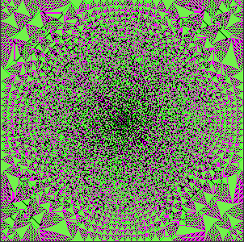

# Sandpiles

An [Abelian sandpile model](https://en.wikipedia.org/wiki/Abelian_sandpile_model) (ASM) simulation written in C++ using raylib. It starts with 10000000 grains of sand at the center of screen then each frame the grains topple to its 4 adjacent neighbors if it has 4 or more grains, and the process repeats until the model stabilizes.

### build
```bash
make main
```

### usage
```bash
./sandpiles [grains] [steps] [hex0] [hex1] [hex2] [hex3]
```
all arguments are optional and positional

### arguments
|argument|explanation|
|--------|-----------|
|grains|initial count of grains at center (default: `1000000`)|
|steps|number of steps per frame (default: `100`)|
|hex0|color of grain 0 (default: `#000000`)|
|hex1|color of grain 1 (default: `#ff0000`)|
|hex2|color of grain 2 (default: `#00ff00`)|
|hex3|color of grain 3 (default: `#0000ff`)|

### controls
|control|action|
|-------|------|
|S|pause/continue animation|

### examples
```bash
./sandpiles 10000000 100 0x000000 0x00ff00 0xff00ff 0xd4af371   
```

